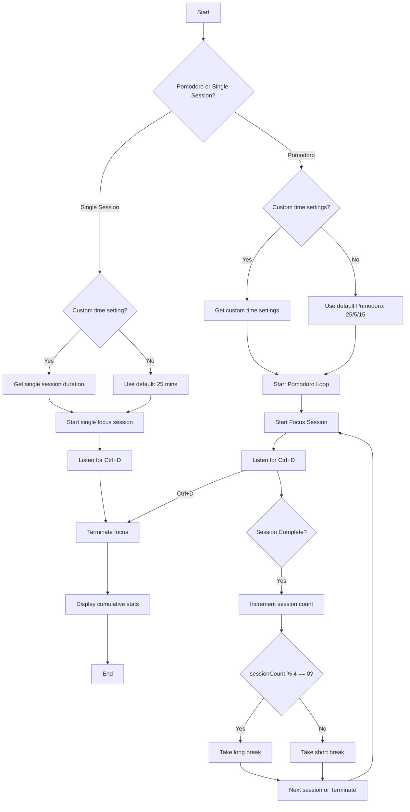
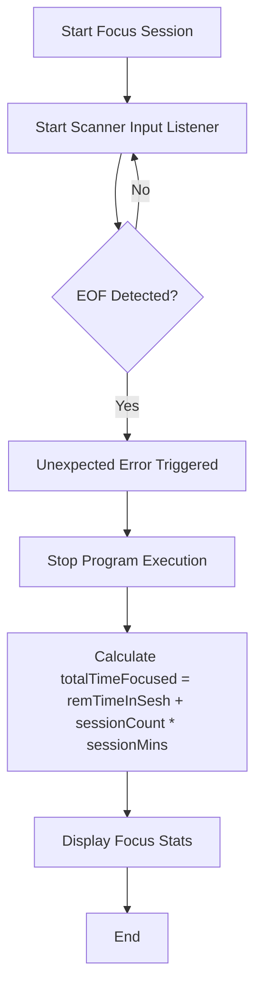

# App Logic
This file contains the logic for certain parts of the app.

## General App Logic

```mermaid
flowchart TD
    A[Start] --> B{Pomodoro or Single Session?}
    B -->|Pomodoro| C{Custom time settings?}
    B -->|Single Session| D{Custom time setting?}
    
    C -->|Yes| E[Get custom time settings]
    C -->|No| F[Use default Pomodoro: 25/5/15]
    
    D -->|Yes| G[Get single session duration]
    D -->|No| H[Use default: 25 mins]
    
    E --> I[Start Pomodoro Loop]
    F --> I

    G --> J[Start single focus session]
    H --> J

    J --> K[Listen for Ctrl+D]
    K --> L[Terminate focus]
    L --> M[Display cumulative stats]
    M --> N[End]

    I --> O[Start Focus Session]
    O --> P[Listen for Ctrl+D]
    P --> Q{Session Complete?}
    Q -->|Yes| R[Increment session count]
    R --> S{sessionCount % 4 == 0?}
    S -->|Yes| T[Take long break]
    S -->|No| U[Take short break]
    T --> V[Next session or Terminate]
    U --> V
    V --> O
    P -->|Ctrl+D| L
```

## Stop Pomodoro Logic
Logic for how to stop Pomodoro sessions...

```mermaid
flowchart TD
    A[Start Focus Session] --> B[Start Scanner Input Listener]
    B --> C{EOF Detected?}
    C -->|No| B
    C -->|Yes| D[Unexpected Error Triggered]
    D --> E[Stop Program Execution]
    E --> F[Calculate totalTimeFocused = remTimeInSesh + sessionCount * sessionMins]
    F --> G[Display Focus Stats]
    G --> H[End]
```